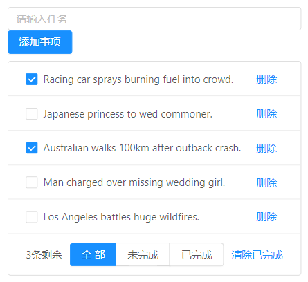

### vuex概述

**组件之间数据共享的方式有：**

- 父组件向子组件共享数据： `v-bind` 属性绑定

- 子组件向父组件共享数据：`v-on` 事件绑定 子组件绑定一个事件来发送数据 `this.$emit(eventName,data)`

- 兄弟组件之间共享数据： `EventBus`，一个组件发送数据，另一个组件接收数据，需要用到一个公共的Vue实例：`bus.$on(eventName,function(e){...})`

**如果需要大范围，频繁地进行数据共享，那么就需要vuex。**

#### vuex是什么

vuex是实现组件全局状态（数据）管理的一种机制，可以方便的实现组件之间数据的共享。

**使用vuex有什么好处？**

- 能够在vuex中集中管理共享的数据，易于开发和后期维护。
- 能够高效地实现组件之间的数据共享，提高开发效率。
- 存储在vuex中的数据都是**响应式**的，能够实时保持数据与页面的同步。

**什么样的数据适合存储到vuex中**

组件之间共享的数据，才有必要存储到vuex中，对于组件中的私有数据，依旧存储在组件自身的data中即可。

#### vuex的state节点

① 安装

```js
npm install vuex --save
```

② 导入vuex包

```js
import Vuex from 'vuex'
Vue.use(Vuex)
```

③ 创建store对象

一般在store/index.js文件中

```js
const store = new Vuex.Store({
    // state中存放的就是全局共享的数据
    state:{ count: 0}
})
```

④ 将store对象挂在到vue实例中

```js
new Vue({
    el: '#app',
    render: h=>h(app),
    router,
    store
})
```

访问store中数据的两种方式：

- 方式一：直接使用 `this.$store.state.count`

- 方式二：使用`mapState`函数将state映射为vue实例中的一个计算属性

```js
// 1.从vuex中按需导入mapState函数
import { mapState } from 'vuex'

// 2.将当前组件需要的全局数据，映射为当前组件的computed计算属性
coumputed: {
    ...mapState(['count'])
}
```

> `...`是展开运算符，这里的意思是将`mapState`函数返回的对象展开。此时当前Vue实例拥有了一个数据为`count`，可以直接通过`this.count`进行调用，但是不能修改。

如果我们将`mapState(['count'])`打印，发现是一个对象，其中有一个属性为`count`

#### vuex的mutations节点

只能通过`mutation`来修改`store`中的数据。这种方式虽然繁琐一些，但是可以集中监控所有数据的变化。

> 尽管也可以通过`this.$store.state.count++`的方式来修改数据，但是强烈不建议这么做。

在`mutations`节点中定义方法：

```js
const store = newe Vuex.Store({
    state: {
        count: 0
    },
    mutations: {
        add(state) {
            state.count++
        }
    }
})
```

触发`mutation`，需要调用`commit`函数

```js
methods: {
    handle() {
        this.$store.commit('add')
    }
}
```

如果需要传参

```js
const store = newe Vuex.Store({
    state: {
        count: 0
    },
    mutations: {
        // 第一个参数永远是state，即当前store中的state对象
        add(state) {
            state.count += 1
        },
        addN(state, step) {
            state.count += step
        }
    }
})
methods: {
    handle() {
        this.$store.commit('addN',3)
    }
}
```

> 实际上 `this.$store.commit('add')`，谁调用`add`方法，谁就把他的`$state`传入。

触发mutations的第二种方法：调用`mapMutations`函数将mutation映射为vue实例中的一个方法。

```js
// 1.从vuex中按需导入mapMutations函数
import {mapMutations} from 'vuex'
// 2.通过刚才导入的mapMutations函数，将需要的mutations函数，映射为当前组件的methods方法
methods: {
    ...mapMutations(['add'])
}
```

> 同`state`类似，`state`是通过`mapState`函数，`mutation`是通过`mapMutations`,前者展开为属性，定义在计算属性节点中。后者展开为方法，定义在`methods`节点中。

#### vuex的actions节点

**Action用于处理异步任务。**

如果通过异步操作变更数据，必须通过Action，而不能使用Mutation，但是在Action中还是要通过触发Mutation的方式简介变更数据。

以下写法是不正确的❌

```js
mutations: {
    add(state) {
      setTimeout(() => {
        state.count++
      }, 1000)
    }
}
```

异步操作要定义到`actions`节点下，但是最终还是会调用`mutations`中的方法。

```js
  mutations: {
    add(state) {
      state.count += 1
    }
  },
  actions: {
    // 第一个传入的参数永远是context即当前store实例对象，因此拥有commit方法
    addAsync(context) {
      setTimeout(() => {
        context.commit('add')
      }, 1000)
    }
  }
```

调用方法一：`this.$store.dispatch('addAsync')`

调用方法二：使用`mapActions`函数将action映射为vue实例的一个方法

```js
import { mapActions } from 'vuex'

methods: {
    ...mapActions(['addAsync'])
}
// 然后就可以直接在组件中进行调用了
this.addAsync()
```

#### vuex的getters节点

getter不会修改state中的数据，只起到包装数据的作用，相当于vue中的计算属性

```js
state: {
    count: 0
},
getters: {
    showNum(state){
        return '当前的值为【'+ state.count + '】'
    }
}
```

访问方式一：

```
this.$store.getter.showNum
```

> 注意：这里不是执行函数`this.$store.getter.showNum()`，而是将其作为一个属性来使用。同vue中的计算属性一样，定义为函数，使用时为属性，不加括号。

访问方式二：调用`mapGetters`方法将getter映射为vue实例中的一个计算属性

```js
import {mapGetters} from 'vuex'

computed: {
    ...mapGetters(['showNum'])
}
```

> 注意：这里展开时候是计算属性，而不是一个方法。

#### 总结

- 数据/状态是定义在`state`节点中的
- `mutations`节点中的函数用来对`state`节点中的数据进行操作
- `actions`节点中的函数专门是进行异步操作的，最终操作数据还是调用`mutations`中的函数
- `getters`是用来包装数据的，相当于`python`对象内置的`__str__`函数

访问的方法：

- `state`节点中的数据`this.$store.state.count`或者通过`...mapState(['count'])`
- `mutations`节点中的方法`this.$store.commit('add')`或者通过`...mapMutations(['add'])`
- `actions`节点中的方法`this.$store.dispatch('addAsync')`或者通过`...mapActions(['addAsync'])`
- `getters`节点中的方法（实际上是当成属性用）`this.$store.getter.showNum`或者通过`...mapGetters(['showNum'])`然后`this.showNum`

> 如果状态量较为多，使用map来将其映射为组件中的属性、方法或者计算属性使用比较方便。如果状态数量较少，那么直接通过`this.$store`来调用较为方便，但是任何时候都不能直接通过`this.$store`来修改数据。

### 基于vuex的案例

参考视频：[哔哩哔哩-vuex从入门到实战-黑马程序员](https://www.bilibili.com/video/BV1h7411N7bg?spm_id_from=333.337.search-card.all.click&vd_source=35fa3e44b90546361b663bf61eec4116)

#### 案例预览

案例源码所在位置： `D:\AllProjects\vueProjects\vuex-demo`



#### 案例需求

一个todo-list，需要实现的功能有：

- 添加事务
- 删除一条事务
- 删除已完成的事务
- 根据“全部”、“未完成”、“已完成” 显示不同的数据
- 显示剩余未完成数量
- 复选框能够选中并发生变化

#### 关键点

##### **定义状态/数据：**

```js
  state: {
    // 所有任务列表
    list: [],
    // 文本框的内容
    inputValue: '',
    // 下一个ID
    nextId: 5,
    // 按钮的类型： all 表示全部  done表示已完成  todo表示未完成
    viewKey: 'all'
  }
```

##### **初始化请求数据**

初始化请求所有数据定义在actions节点中，因为是异步请求动作。

```js
  actions: {
    // 请求数据，异步动作，放到actions中
    getList(context) {
      axios.get('/data.json').then(({ data }) => {
        context.commit('initList', data)
      })
    }
  },
```

实际上还是调用了mutations节点中的initList方法: 该方法为list赋初值。

```js
  mutations: {
    initList(state, val) {
      state.list = val
    },
  }
```

而在vue视图中，在created中调用触发action：

```vue
 created() {
    // 触发请求数据的action
    this.$store.dispatch('getList')
  }
```

##### **监听输入框状态**

```html
<a-input
  placeholder="请输入任务"
  class="my_ipt"
  :value="inputValue"
  @change="handleInputChange"
/>
<a-button type="primary" @click="addItem">添加事项</a-button>
```

输入框的value是动态绑定的，和store中的inputValue一致，而如果需要这么使用，就需要将inputValue进行映射

```js
...mapState(['inputValue'])
```

监听到输入框内容发生变化，将最新内容赋值给inputValue

```js
handleInputChange(e) {
    this.$store.commit('setInputValue', e.target.value)
}
```

```js
setInputValue(state, val) {
  state.inputValue = val
}
```

##### **监听复选框状态**

```html
<a-checkbox
  :checked="item.done"
  @change="cbStatusChanged($event, item.id)"
  >{{ item.info }}
</a-checkbox>
```

同理复选框的checked值也要动态绑定，且需要监听其选中状态的变化

```js
 cbStatusChanged(e, id) {
      // 通过e.target.checked可以接收到最新的选中状态
      const param = {
        val: e.target.checked,
        id: id
      }
      this.$store.commit('changeStatusById', param)
    },
```

需要传入$event对象，才能获取到最新的选中状态，true为选中，false为未选中。然后触发changeStatusById进行修改：

```js
changeStatusById(state, param) {
  // done: param.val id: param.id
  const i = state.list.findIndex((item) => item.id === param.id)
  state.list[i].done = param.val
},
```

因为只能穿一个参数，因此要封装成对象。

##### **删除一条记录**

```js
<a slot="actions" @click="removeById(item.id)">删除</a>
// methods节点中
removeById(id) {
  this.$store.commit('removeById', id)
},

// store/index.js中
removeById(state, id) {
  // 删除对应的数据
  const i = state.list.findIndex((item) => item.id === id)
  if (i !== -1) {
    state.list.splice(i, 1)
  }
},
```

##### **删除所有已经完成的记录**

同上。

```js
cleanDone() {
 this.$store.commit('cleanDone')
},
        
cleanDone(state) {
 // 清除所有done为true的数据
 state.list = state.list.filter((item) => !item.done)
},
```

##### **根据不同视图显示不同的数据**(难点)

这里需要一个ViewKey来记录用户选择的是什么

```html
<a-button-group>
  <a-button
    :type="viewKey === 'all' ? 'primary' : 'default'"
    @click="changeList('all')"
    >全部</a-button
  >
  <a-button
    :type="viewKey === 'notDone' ? 'primary' : 'default'"
    @click="changeList('notDone')"
    >未完成</a-button
  >
  <a-button
    :type="viewKey === 'done' ? 'primary' : 'default'"
    @click="changeList('done')"
    >已完成</a-button
  >
</a-button-group>
```

viewKey要想直接使用，也得先映射：

```js
...mapState(['inputValue', 'viewKey'])
```

用户点击某个按钮后，触发changeList

```js
changeList(key) {
  this.$store.commit('changeViewKey', key)
}
```

提交changeViewKey,将用户的更改同步到ViewKey

```js
changeViewKey(state, key) {
  // 改变ViewKey的值：all done notDone
  state.viewKey = key
}
```

而button的type是动态绑定的：选中的为primary,否则为default

```js
:type="viewKey === 'notDone' ? 'primary' : 'default'"
```

至于数据：使用的是Getters,相当于计算属性,未完成数量也是getter,在getters节点下：

```js
notDoneCount(state) {
  return state.list.filter((item) => !item.done).length
},
getListByKey(state) {
      // 根据类型返回数据
      if (state.viewKey === 'all') {
        return state.list
      }
      if (state.viewKey === 'done') {
        return state.list.filter((item) => item.done)
      }
      if (state.viewKey === 'notDone') {
        return state.list.filter((item) => !item.done)
      }
      // 返回默认选项
      return state.list
    }
  }
```

然后在computed节点下需要映射为计算属性：

```js
...mapGetters(['notDoneCount', 'getListByKey'])
```

最后在视图上可以直接使用

```html
<a-list bordered :dataSource="getListByKey" class="dt_list">
<span>{{ notDoneCount }}条剩余</span>
```
